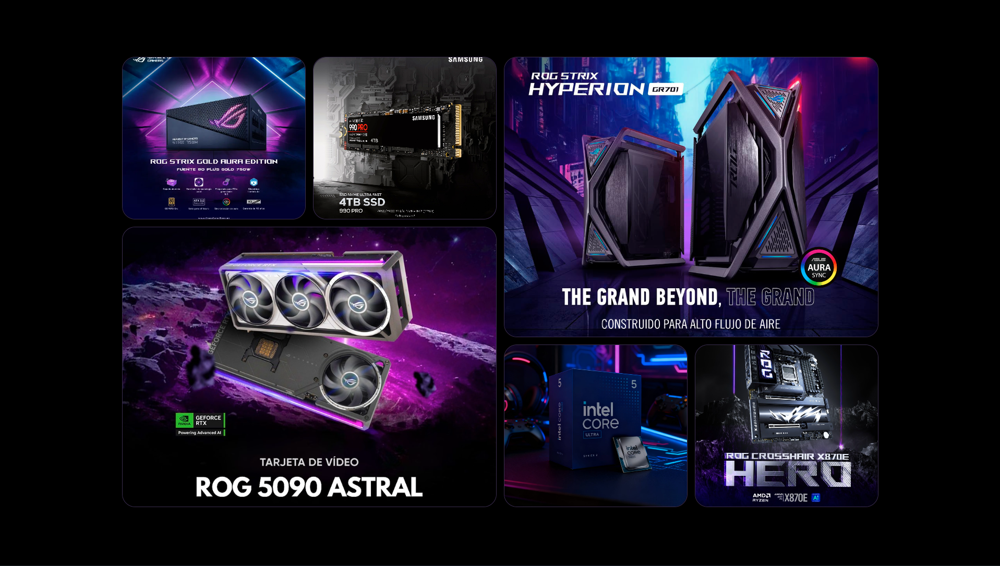

# 🥡 Magic Bento — React + TypeScript + Vite

¡Bienvenido/a! 🎉 Este repo contiene una pequeña aplicación llamada *Magic Bento*: una UI interactiva creada con React, TypeScript y Vite, con animaciones hechas con GSAP para darle vida a la experiencia. 🌟

---

<div align="center">
  
</div>

---

## 🧰 Tecnologías / Tech Stack

- TypeScript
- React
- Vite (dev server rápido con HMR)
- GSAP (animaciones)
- CSS (estilos locales)
- ESLint (calidad de código)

Dependencias principales (ver `package.json`): `react`, `react-dom`, `gsap`.

## 🚀 Características

- Inicio rápido con Vite (dev server + hot reload)
- Componentes en `src/components` (principal: `MagicBento`) 🧩
- Animaciones suaves con GSAP ✨
- Tipado con TypeScript ✅

## 🧾 Requisitos

- Node.js (recomendado >= 16; 18+ sugerido)
- npm o yarn (ejemplos aquí con npm)

Si tienes problemas, prueba con Node 18 o 20. 🔧

## 🛠 Instalación y ejecución (local)

1) Clona el repositorio y entra en la carpeta:

```powershell
git clone <url-del-repositorio>
cd magic-bento-ts
```

2) Instala dependencias:

```powershell
npm install
```

3) Arranca el servidor de desarrollo:

```powershell
npm run dev
```

4) Abre tu navegador en la URL que muestre Vite (por defecto http://localhost:5173) 🌐

Comandos útiles:

- `npm run dev` — iniciar dev server
- `npm run build` — compilar para producción (`tsc -b && vite build`)
- `npm run preview` — previsualizar build localmente
- `npm run lint` — ejecutar ESLint

## 📁 Estructura del proyecto

- public/ — activos estáticos (imágenes, etc.)
- src/
  - main.tsx — monta la app React
  - App.tsx — componente raíz
  - index.css, App.css — estilos globales
  - components/
    - MagicBento.tsx — componente principal 🥡
    - MagicBento.css — estilos del componente
  - assets/ — recursos empaquetados
- index.html — plantilla de Vite
- package.json — scripts y dependencias
- tsconfig*.json — configuración TypeScript
- vite.config.ts — configuración de Vite

Explora `src/components/MagicBento.tsx` para ver las animaciones y la lógica. 👀

## 📦 Despliegue

La app genera una carpeta `dist` tras `npm run build`. Opciones comunes para desplegar:

- Vercel: build command `npm run build`, output `dist` ✅
- Netlify: build command `npm run build`, publish `dist` ✅
- GitHub Pages: usar GH Actions o `gh-pages` para publicar `dist` 🪄
- Servidor estático (NGINX, S3 + CloudFront, etc.)

Ejemplo local para probar producción:

```powershell
npm run build; npm run preview
```

## 💡 Notas y recomendaciones

- Revisa `tsconfig*.json` si necesitas alias o cambios de compilación.
- Añade Prettier si quieres formato automático y reglas de estilo.
- Optimiza imágenes y revisa importaciones para mantener bundles pequeños.
- Si amplías el proyecto, considera tests (Jest, Vitest) y reglas de lint más estrictas.

## 🤝 Cómo contribuir

1. Haz fork y crea una rama descriptiva:

```powershell
git checkout -b feature/mi-nueva-caracteristica
```

2. Haz commits pequeños y claros, ejecuta linters, y abre un Pull Request explicando los cambios.

Buenas prácticas:
- Mantén los tipos de TypeScript precisos.
- Documenta animaciones complejas en comentarios.

---

*Last update: May 2026*